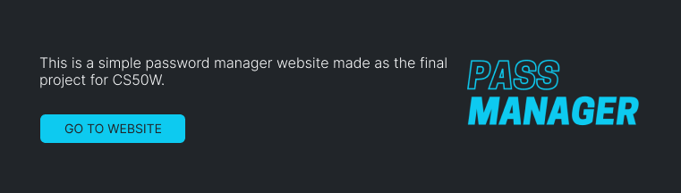

# Password Manager

[<p align="center"></p>](https://passmanager.onrender.com)

<p align="center"></p>
<p align="center"></p>

## How to run

### Prerequisites

Before you start, you need to have [Python](https://www.python.org/downloads/) 3.8 (or higher version) installed on your machine.

### Running

```bash
# clone this repository
$ git clone <https://github.com/plhrsl/passmanager>

# enter the project folder
$ cd passmanager

# start a virtual environment (here i'm using pipenv)
$ pipenv shell

# install the requirements to run the project
$ pip install -r requirements.txt

# make the migrations
$ python manage.py makemigrations

# apply migrations to your database
$ python manage.py migrate

# start the web server
$ python manage.py runserver

# the development server will start at http://localhost:8000/
```

## Distinctiveness and complexity

Similarly to project 3 (mail) this is a single page web app that uses JavaScript to make requests to routes defined in the backend and control which parts of the page are displayed. However, it is a password manager - a type of application not explored in previous projects - thus distinguishing itself from these.

The greater complexity of the page in relation to previous projects is in the functionalities related to the frontend, such as: option to show/hide the password; the button that allows you to copy the username and password to the user's clipboard; and the favicon display of the access sites.

## Files

The main directory is a Django project called `passmanager` that contains a single app called `pass`.

The `pass` directory contains files and folders that make up a Django app. Let's highlight some of them: the `static/pass` and `templates/pass` folders and the `models.py`, `views.py` and `urls.py` files.

- `static/pass`

  Here are the application's static files: `index.js`, which contains the JavaScript code; `styles.css`, which contains some additional styling - given that the main styling of the webapp was done using the _Bootstrap_ framework; lock.png - the site's logo - and favicon.ico.

  The script contains functions that deal with showing/hiding parts of the HTML document and dynamically generating HTML elements. Moreover, every request to the server is made using JavaScript. The defined functions are as follows:

  - _`getAccesses()`_ - responsible for obtaining the accesses of the logged in user and generating, for each of them, a card element with their information. Each card is appended to the accesses view div.

  - _`loadAccessesView()`_ and _`loadAccessView()`_ - toggle between showing the home page with all user accesses or the access add/edit form.

  - _`addAccess()`_, _`updateAccess()`_ and _`deleteAccess()`_ - perform, respectively, POST, PUT and DELETE requests to the server.

  - _`generatePassword()`_ - generates a strong password for the user.

  - _`copy()`_ - copy username or password to user's clipboard.

  - _`hideAndUnhide()`_ - toggles between displaying or not displaying the password for a certain access on the screen.

  - _`showAlert()`_ - creates an alert HTML element for some actions within the app: copy username/password; and add, edit, or remove access.

- `templates/pass`

  This folder all the app's html files: `layout.html` - which contains the structure base of the other pages, including the navigation bar; `login.html` and `register.html`, which contain the application's registration and login forms; and `index.html`, the main page.

  <small>It's considered good development practice in Django projects for templates and static folders to contain a directory with the same name as the app it belongs to.</small>

- `models.py`

  This file defines the application models. A model contains the essential fields and behaviors of the data being stored, and each of these maps to a table in the database. In the case of this application, two models are defined: _User_ - which inherits from the AbstractUser provided by Django; and _Access_ - which contains the fields user, site, username and password.

- `views.py` and `urls.py`

  In `views.py` the behaviors of each one of the routes created in the `urls.py` file are defined. Each path is linked to a function:

  - _`/register`_, _`/login`_ and _`/logout`_ - control the registration, login and logout of users.

  - _`/home`_ - returns a JSON Response containing an array with all accesses of the logged in user.

  - _`/accesses`_ - receives POST requests and creates new accesses.

  - _`/accesses/<int:access_id>`_ - receives GET, PUT and DELETE requests and returns, edits or removes an access based on id.

#### Video demo: https://youtu.be/t5CFSgU1R5I

